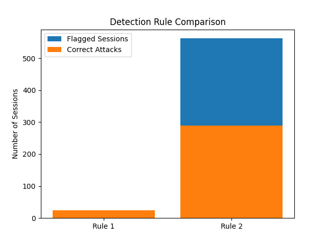

# Login Anomaly Detection & Security Analysis

## Overview
This project analyzes login session data to detect anomalous behavior and evaluate rule-based detection strategies.

## Objective
- Identify suspicious login behavior
- Analyze failed login patterns
- Evaluate anomaly detection rules
- Compare detection accuracy and coverage

## Tools Used
- Python
- pandas
- matplotlib
- GitHub

## Dataset Summary
- Total sessions: 899
- Normal: 476
- Attacks: 423

## Key Findings

- Nearly half of sessions were classified as attacks
- Failed login attempts and unusual access times are key indicators
- No single factor alone reliably detects attacks

## Detection Rule Comparison

## Key Insight

A tradeoff exists between detection accuracy and coverage:

- **Rule 1 (strict)**: High precision, low coverage  
- **Rule 2 (broad)**: Higher coverage, more false positives  

## Skills Demonstrated
- Data analysis with Python
- Cybersecurity behavior analysis
- Rule-based anomaly detection
- Data visualization
